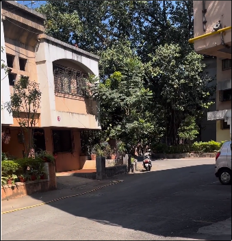

# \$$Ez-Pz$$ [OSINT]

## Description

My friend borrowed some money from me. He promised to return it to me within a week. We made a pact that if he doesn't returns my money, I'll steal something precious from him. When the deadline past away, i started to wonder what should i steal? His Gf? nah. His bike? nah he has a burgman. His house? interesting.... So basically, i made this description because i was bored and it does not make any sense nor does it have any clue hehe, in short, you just have to find the location of the place where the money is hidden. Happy Hunting ;)

<https://www.instagram.com/reel/C2zCjmELG-u/>

## Solution

`0CTF{Parmar_Residency}`

## But How?

### Find The Location

Took a screenshot of the reel and uploaded it to `Google Lens` to find the location. As the name of the instagram handle was `cash.hunt.pune`, filtered all the results to `Pune`.

The location was `Parmar Residency, Kondhwa, Pune`.
